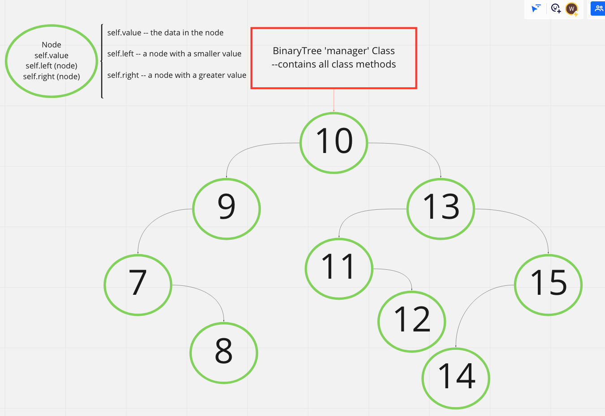
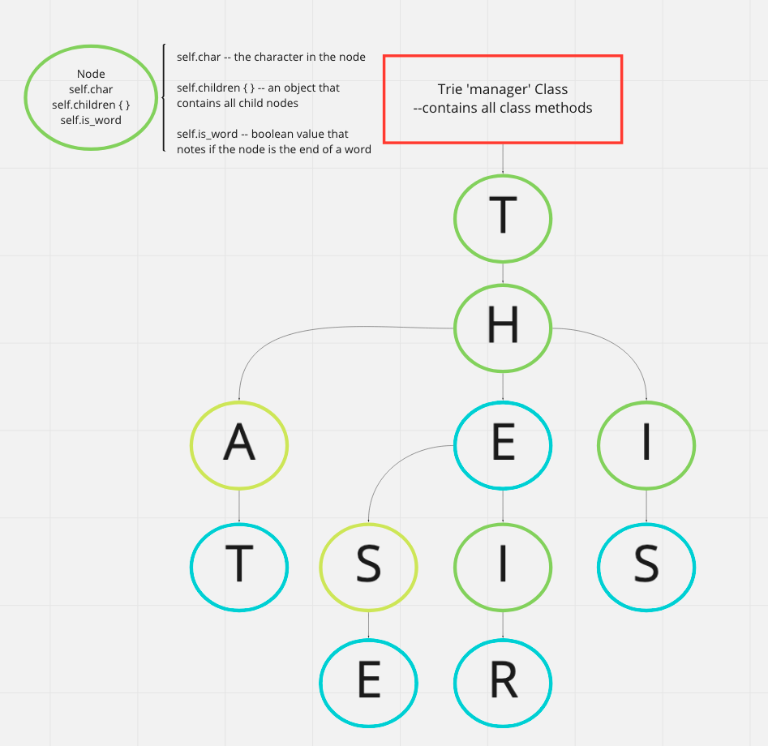

# Binary Search Tree 🌴

We are going to be implementing a Binary Tree together! 🎉

Since Trees are a data structure that relies on nodes, I like to think of a Binary Tree as a pre-sorted type linked list. There is a little alorithmic logic to how a BST stores the data.

To get started head over to BinaryTree.py and check out the classes there. There are method stubs that we are going to fill out together!

#### Data structures that rely on nodes

...and a good order to study them in.

## Links

gitbook:

https://gawdiseattle.gitbook.io/wdi/08-cs/cs-trees-data-structures

imbalanced binary tree:

https://appliedgo.net/balancedtree/

miro board:

https://miro.com/app/board/o9J_lWxUo_o=/

visualgo:

https://visualgo.net/en/bst

code along built from theses resources:

https://www.tutorialspoint.com/python_data_structure/python_binary_tree.html

https://www.geeksforgeeks.org/binary-tree-set-1-introduction/

## Here is a visual representaion of a Binary Search Tree

## Here is a visual representation of a Trie

###### tags: `lessons`